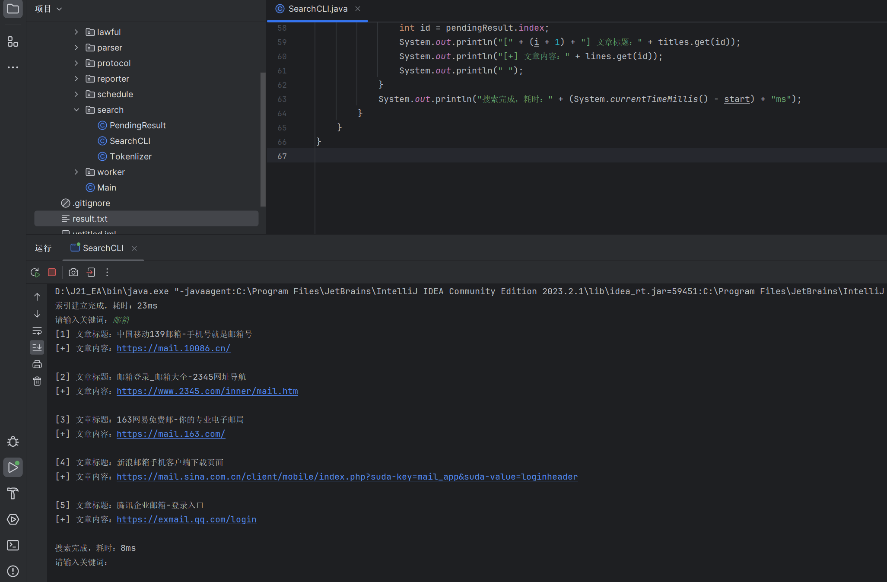

crawl4j
---

## 简介

Crawl4j是一个开源的互联网搜索引擎。你可以使用它在一个小时内索引上万个互联网站点，并进行毫秒级检索。  
Crawl4j致力于为个人提供可自行部署的搜索引擎，让每个人都能拥有自己的搜索引擎，而不是被少数大公司垄断。  
每个人都可以使用Crawl4j来创建自己的搜索引擎，而不需要任何专业知识。  

网页版搜索正在研发中。

## 目标

Crawl4j架构上追求精简、别致。因此，Crawl4j会尽力追求：

- 0依赖：Crawl4j不依赖任何第三方库，只使用Java标准库。
- 0配置：Crawl4j不需要任何配置，只需要一个jar包即可运行。
- 可接受：Crawl4j能够在标准的个人电脑上运行。

Crawl4j可能不会去考虑：

- 性能：Crawl4j不会去追求毫秒以下的性能。
- SLA：Crawl4j不会去追求99%以上的稳定性。只要能够重启后继续运行即可。
- 热插拔：Crawl4j的索引数据库不支持热插拔。包括Token持久化在内的模块全部不会被考虑实现。

## 使用

Crawl4j需要Java 8或以上版本。  
对于普通用户，只需要从[Release](https://github.com/huzpsb/crawl4j/releases)页面下载最新的jar包并运行即可。  
我们提供交互式的指南，让你可以轻松地使用Crawl4j。

## 开发与TODO

Crawl4j的开发目前处于早期阶段，因此我们欢迎任何形式的贡献。   
你可以通过提交Issue来提出你的想法，或者直接提交Pull Request。  
目前而言，我们正在着手完成：

- [ ] 网页版搜索引擎
- [ ] 更好的Spider.txt合规性支持
- [x] 交互式引导

## 注意事项

1，Crawl4j目前处于早期阶段，因此可能会有很多问题。并且设计上Crawl4j就不是为企业准备的。  
如果有因为Crawl4j的缺陷导致的任何损失，我无法承担任何责任。如果不能接受这一点，请不要使用Crawl4j。

2，Crawl4j对Spider.txt的支持尚未完善，由于Spider.txt的规范性问题，Crawl4j可能会无法正确解析Spider.txt。  
在使用时，请务必手动再次确认Spider.txt的规范性。

3，请在通过修改代码来修改Crawl4j的行为，与新建索引库时，务必注意相关规定与条款。  
在网站使用者不同意这么做的时候，你不应该这么做。否则请自行承担法律责任。